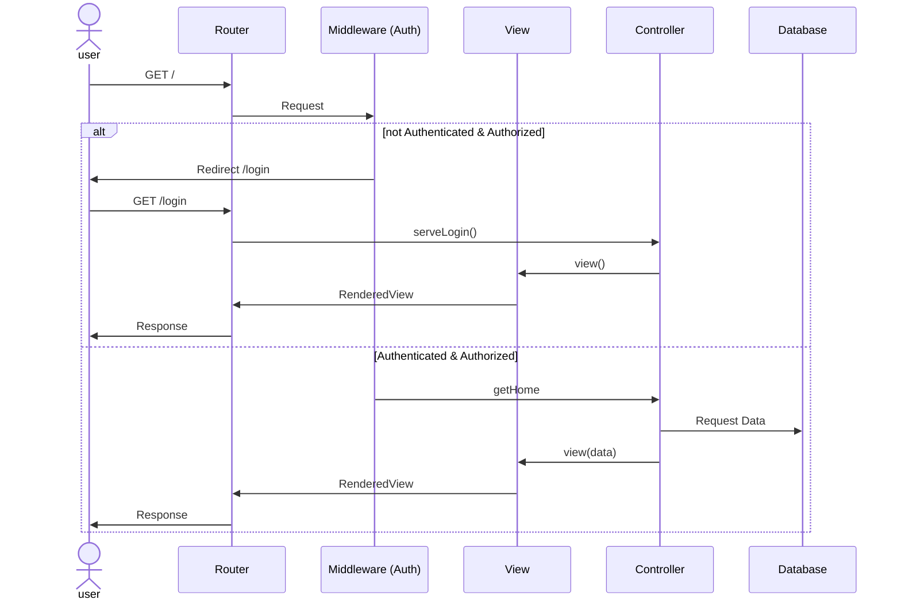

# How to initially run

```
cd POC
composer install
npm install
cd ..
php artisan key:generate
type nul > database\database.sqlite
php artisan key:generate
php artisan migrate:fresh
php artisan serve
```

With the use of Herd just add the project to Herd instead of `php artisan serve`

## Sequence diagramm
