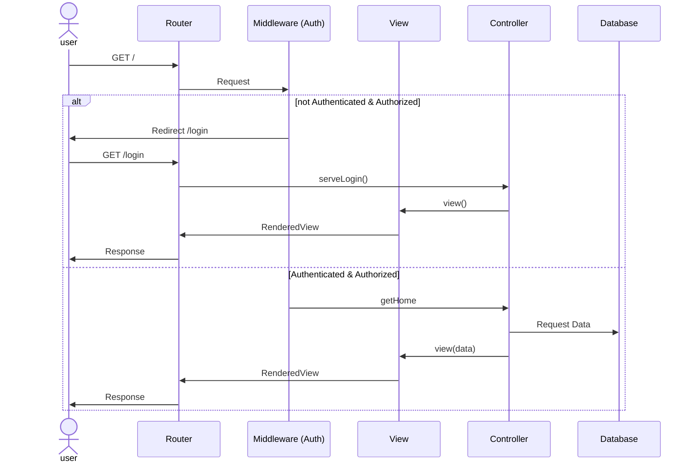

# How to initially run

```
cd POC
composer install
npm install
cd ..
php artisan key:generate
type nul > database\database.sqlite
php artisan key:generate
php artisan migrate:fresh
php artisan serve
```

With the use of Herd just add the project to Herd instead of `php artisan serve`

## Sequence diagramm

# How to setup Mosquitto, MQTT, and run it.

1. composer install (in terminal to update with phpMQTT)

2. Download Mosquitto binary installation from https://mosquitto.org/download/

3. In "C:\Program Files\mosquitto\mosquitto.conf", add these at the end of the file and save.
listener 1883
allow_anonymous true

4. In a seperate cmd, run these two and keep it open in the background 
cd "C:\Program Files\mosquitto"
mosquitto.exe -c mosquitto.conf -v

5.  In your .env file, add
MQTT_HOST=Your Own IP, run ipconfig in cmd to find the IPv4
MQTT_PORT=1883 (keep the same as mosquitto uses port 1883)

6. In PicoSem\config.h, change WIFI_SSID & WIFI_PASS & BROKER_IP_STRING (same IP as MQTT_HOST) strings to your own hotspot info.

7. Run this command to rebuild
cmake --build . --clean-first

8. Flash the pico like normal, PicoSem\build\PicoSem.uf2

9. php artisan serve, pressing the button should show 3 buzzer beeps and 3 LED flashes.
